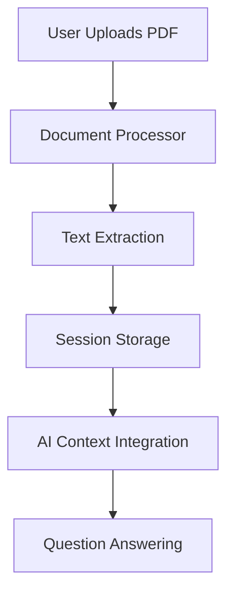

# Medical Records Document Processing

This document explains the PDF medical records upload and processing feature implemented in the Virtual Doctor Assistant application. This feature allows users to upload their medical records in PDF format during a conversation with the virtual doctor, enabling the AI to reference specific information from these documents when answering questions.

## Table of Contents

- [Medical Records Document Processing](#medical-records-document-processing)
  - [Table of Contents](#table-of-contents)
  - [Overview](#overview)
  - [Document Parsing](#document-parsing)
    - [Technology](#technology)
    - [Parsing Process](#parsing-process)
    - [Code Implementation](#code-implementation)
  - [Data Storage](#data-storage)
    - [Session State Storage](#session-state-storage)
    - [Data Structure](#data-structure)
    - [Session Management](#session-management)
  - [AI Integration](#ai-integration)
    - [Context Enhancement](#context-enhancement)
    - [Query Detection](#query-detection)
    - [Context Management](#context-management)
    - [AI Instructions](#ai-instructions)
  - [User Experience](#user-experience)
    - [Upload Interface](#upload-interface)
    - [User Feedback](#user-feedback)
    - [Example Interaction](#example-interaction)
  - [Privacy Considerations](#privacy-considerations)
    - [Data Security](#data-security)
    - [User Control](#user-control)
    - [Compliance Considerations](#compliance-considerations)
  - [Future Enhancements](#future-enhancements)
    - [Advanced Document Processing](#advanced-document-processing)
    - [Improved User Experience](#improved-user-experience)
    - [AI Capabilities](#ai-capabilities)

## Overview

The document processing feature enhances the Virtual Doctor Assistant by allowing it to:

- Accept PDF uploads of medical records
- Extract text content while preserving page structure
- Store the extracted text in the session state
- Reference specific pages and sections when answering user questions
- Maintain user privacy by keeping all data in the session state only



## Document Parsing

### Technology

The application uses **PyMuPDF** (imported as `fitz`), a powerful PDF processing library, to extract text from uploaded PDF files. PyMuPDF was chosen for its:

- Robust text extraction capabilities
- Ability to preserve document structure
- Support for various PDF formats
- Efficient processing of large documents

### Parsing Process

When a user uploads a PDF file, the following steps occur:

1. The file is read as a byte stream
2. PyMuPDF opens the document from the byte stream
3. Basic metadata (filename, page count) is extracted
4. Text is extracted page by page, with page numbers preserved
5. The extracted text is formatted with page markers for easy reference

### Code Implementation

The core document processing functionality is implemented in `document_processor.py`:

```python
import fitz  # PyMuPDF
import streamlit as st
import time
import io

def process_pdf(uploaded_file):
    """
    Process a PDF file using PyMuPDF to extract text.

    Args:
        uploaded_file: The uploaded PDF file from Streamlit

    Returns:
        dict: Contains extracted text and metadata
    """
    try:
        with st.spinner("Processing PDF..."):
            # Read the file as bytes
            file_bytes = uploaded_file.read()

            # Open the PDF with PyMuPDF
            with fitz.open(stream=file_bytes, filetype="pdf") as doc:
                # Get basic metadata
                metadata = {
                    "filename": uploaded_file.name,
                    "page_count": len(doc)
                }

                # Extract text with page numbers for reference
                full_text = ""
                for i, page in enumerate(doc):
                    text = page.get_text()
                    full_text += f"\n--- Page {i+1} ---\n{text}\n"

                return {
                    "success": True,
                    "metadata": metadata,
                    "text": full_text
                }
    except Exception as e:
        return {
            "success": False,
            "error": str(e),
            "metadata": {"filename": uploaded_file.name if hasattr(uploaded_file, 'name') else "unknown"},
            "text": ""
        }
```

## Data Storage

### Session State Storage

All extracted document data is stored in Streamlit's session state, which provides:

- Temporary storage that persists during the user's session
- Automatic cleanup when the session ends
- No permanent storage of sensitive medical information
- Isolation between different user sessions

### Data Structure

The extracted document data is stored in the session state with the following structure:

```python
st.session_state.medical_records = [
    {
        "metadata": {
            "filename": "patient_record.pdf",
            "page_count": 5
        },
        "text": "--- Page 1 ---\n[Content of page 1]\n--- Page 2 ---\n[Content of page 2]\n...",
        "timestamp": 1621234567.89
    },
    # Additional documents if multiple uploads are made
]
```

### Session Management

When a user resets their session or starts a new conversation:

- All document data is cleared from the session state
- The `last_uploaded_file` reference is reset
- No document data persists between sessions

## AI Integration

### Context Enhancement

When a user asks a question that might be related to their uploaded medical records, the application:

1. Detects potential document-related queries using keyword matching
2. Retrieves the most recently uploaded document from the session state
3. Adds the document content as a system message in the AI's conversation context
4. Instructs the AI to reference specific pages when answering

### Query Detection

The application uses a simple keyword-based approach to detect document-related queries:

```python
doc_keywords = ["medical record", "document", "pdf", "report", "test", "result",
                "lab", "diagnosis", "record", "upload"]

if ('medical_records' in st.session_state and
    st.session_state.medical_records and
    any(keyword in user_input.lower() for keyword in doc_keywords)):

    document_query = True
    # Process as document query
```

### Context Management

To prevent the AI's context from growing too large, the document content is:

1. Added to the context only when a document-related query is detected
2. Removed from the context after the AI generates a response
3. Re-added if another document-related query is detected

```python
# Add document context as a system message
document_context = (
    f"The user is asking about their medical record '{latest_record['metadata']['filename']}'. "
    f"Here is the content of the document:\n\n{latest_record['text']}\n\n"
    f"When answering, reference specific parts of the document by mentioning the page number "
    f"where the information is found. Format as [Page X]."
)

# Add the document context as a system message
st.session_state.agent_messages.append({
    "role": "system",
    "content": document_context
})

# Later, after generating the response:
# Remove the document context system message
st.session_state.agent_messages = [
    msg for msg in st.session_state.agent_messages
    if not (msg["role"] == "system" and "Here is the content of the document" in msg.get("content", ""))
]
```

### AI Instructions

The AI agent is specifically instructed on how to handle medical records:

```
## Medical Record References
When a user uploads medical records, you can reference information from these documents in your responses. When doing so:
- Cite the specific page number where information is found using [Page X] format
- Explain medical terminology in plain language
- Connect information from the records to the user's current concerns
- Acknowledge when information might be unclear or incomplete
- Maintain patient privacy and confidentiality
```

## User Experience

### Upload Interface

The document upload interface is integrated directly into the chat interface, allowing users to:

- Upload PDF files during the conversation
- Receive immediate feedback on successful processing
- Ask questions about the uploaded documents
- See references to specific pages in the AI's responses

### User Feedback

The application provides clear feedback throughout the process:

- A spinner during document processing
- Success messages when processing is complete
- Error messages if processing fails
- Confirmation in the chat that the document was processed

### Example Interaction

```
User: *uploads medical_record.pdf*

System: "Medical record 'medical_record.pdf' processed successfully!"

User: "What does my medical record say about my cholesterol levels?"

AI: "According to your medical record [Page 3], your most recent cholesterol test shows a total cholesterol level of 185 mg/dL, which is within the normal range. Your LDL ('bad' cholesterol) is 110 mg/dL and your HDL ('good' cholesterol) is 55 mg/dL. These values indicate healthy cholesterol levels."
```

## Privacy Considerations

### Data Security

The medical records upload feature was designed with privacy and security as top priorities:

- All document data is stored only in the user's session state
- No data is persisted to disk or databases
- Data is automatically cleared when the session ends
- No document data is sent to external services

### User Control

Users maintain full control over their medical records:

- They can choose which documents to upload
- They can reset the session at any time to clear all data
- They receive clear feedback about what happens to their data

### Compliance Considerations

While this implementation provides basic privacy protections, a production deployment should consider:

- HIPAA compliance for healthcare applications in the US
- GDPR compliance for applications serving European users
- Additional encryption for sensitive medical data
- Audit logging for document access

## Future Enhancements

### Advanced Document Processing

Future versions could implement more sophisticated document processing:

- OCR for scanned documents with poor text extraction
- Structured data extraction for lab results and medications
- Medical terminology recognition and explanation
- Support for additional medical document formats

### Improved User Experience

The user experience could be enhanced with:

- Document preview capability
- Ability to upload multiple documents
- Document management interface
- Highlighting of relevant sections in responses

### AI Capabilities

The AI integration could be improved with:

- Fine-tuning on medical document understanding
- More sophisticated document query detection
- Semantic search within documents
- Trend analysis for lab results over time
