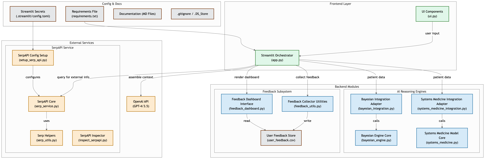

# Virtual Doctor Assistant


The AI Doctor is a virtual healthcare assistant application that provides a medical consultation experience. Built with Python, Streamlit and powered by OpenAI's GPT models, it provides personalized data-driven medical guidance through an interactive interface.

## Core Functionality

The virtual doctor agent:

1. **Collects Patient Information** through an intuitive form interface (demographics, symptoms, medical history, medications)

2. **Analyzes Health Data** using three sophisticated systems:

   - Bayesian reasoning for probabilistic diagnosis
   - Systems Medicine approach that views the body as interconnected (rather than compartmentalized)
   - SERP API integration for up-to-date medical information

3. **Provides Holistic Assessment** by:

   - Identifying connections between seemingly unrelated symptoms
   - Recognizing patterns across multiple body systems
   - Considering how lifestyle factors affect overall health
   - Weaving together insights from multiple medical specialties

4. **Delivers Personalized Guidance** including:

   - Potential explanations for symptoms
   - Lifestyle recommendations
   - Suggestions for when to seek in-person care

The application emphasizes a unified healthcare approach that addresses the limitations of compartmentalized medicine, recognizing that inflammation, diet, stress, and other factors are intertwined across multiple body systems.



## Live Demo

The application is live at: **[https://ai-doctor-v1.streamlit.app/](https://ai-doctor-v1.streamlit.app/)**

## Technologies Used

- **Frontend**: Streamlit
- **Backend**: Python
- **AI**: OpenAI API (GPT-4o, GPT-4-turbo, GPT-3.5-turbo)
- **AI Framework**: OpenAI Agents Python library
- **Bayesian Reasoning**: Custom Bayesian probability engine for medical diagnosis
- **Systems Medicine**: Unified approach connecting multiple body systems
- **Data Handling**: Pandas
- **Web Search**: SerpAPI for medical information retrieval
- **Styling**: Custom CSS

## Prerequisites

- Python 3.9 or higher
- OpenAI API key
- SERP API key (for medical information retrieval)

## Installation

1. Clone the repository:

   ```bash
   git clone https://github.com/yourusername/virtual-doctor-assistant.git
   cd virtual-doctor-assistant
   ```

2. Create and activate a virtual environment:

   ```bash
   python -m venv env
   source env/bin/activate  # On Windows: env\Scripts\activate
   ```

3. Install the required packages:

   ```bash
   pip install -r requirements.txt
   ```

4. Run the setup script to configure the SERP API integration:

   ```bash
   python setup_serp_api.py
   ```

   This script will:

   - Check if the required packages are installed
   - Create a `.streamlit/secrets.toml` file if it doesn't exist
   - Guide you through adding your API keys
   - Test the SERP API integration

   Alternatively, you can manually create a `.streamlit/secrets.toml` file with your API keys:

   ```toml
   # OpenAI API key for the main assistant functionality
   OPENAI_API_KEY = "your-openai-api-key-here"

   # SERP API key for medical information retrieval
   # Get your key at: https://serpapi.com/
   SERP_API_KEY = "your-serp-api-key-here"
   ```

## Usage

1. Run the Streamlit application:

   ```bash
   streamlit run app.py
   ```

2. Open your browser and navigate to the URL displayed in the terminal (usually http://localhost:8501)

3. Fill out the patient information form:

   - Navigate through the tabs to provide your information
   - Required fields are in the Basic Info and Symptoms tabs
   - Enter your height and weight to receive a BMI assessment
   - Review your information in the Submit Information tab
   - Click "Submit Information" to proceed

4. Chat with the virtual doctor:
   - After submitting your information, click on the "Virtual Doctor" button in the sidebar
   - The virtual doctor will acknowledge your BMI assessment and provide health recommendations
   - Type your messages in the chat input field
   - Receive responses from the AI-powered virtual doctor

## 📁 Project Structure

```
virtual-doctor-assistant/
├── app.py                           # Main application file
├── ui.py                            # UI components and styling
├── bayesian_engine.py               # Bayesian probability engine for medical diagnosis
├── bayesian_integration.py          # Integration of Bayesian engine with doctor agent
├── systems_medicine.py              # Systems medicine model for unified healthcare approach
├── systems_medicine_integration.py  # Integration of systems medicine with doctor agent
├── test_bayesian_engine.py          # Test script for Bayesian engine
├── serp_service.py                  # SERP API service for medical information retrieval
├── serp_utils.py                    # Utility functions for SERP API integration
├── setup_serp_api.py                # Setup script for SERP API integration
├── test_serp_api.py                 # Test script for SERP API integration
├── feedback_utils.py                # Feedback collection and analysis utilities
├── feedback_dashboard.py            # Feedback visualization dashboard
├── SERP_API_INTEGRATION.md          # Documentation for SERP API integration
├── BAYESIAN_ENHANCEMENT.md          # Documentation for Bayesian enhancement
├── SYSTEMS_MEDICINE_ENHANCEMENT.md  # Documentation for Systems Medicine enhancement
├── .streamlit/                      # Streamlit configuration
│   └── secrets.toml                 # API keys and secrets
├── feedback/                        # Feedback data storage directory
│   └── user_feedback.csv            # Feedback data in CSV format
├── requirements.txt                 # Project dependencies
└── README.md                        # Project documentation
```

## Implementation Details

### Architecture

The application follows a modular architecture with separation of concerns:

- **app.py**: Contains the main application logic, session state management, and API calls
- **ui.py**: Contains all UI components, styling, and rendering functions

### AI Integration

The application uses OpenAI's GPT models and Agents framework to power the virtual doctor assistant:

- System instructions define the assistant's role and limitations
- Patient information including BMI assessment is added to the conversation context
- The assistant maintains a conversational history for context-aware responses
- Specialized agents handle specific tasks like BMI calculation

### SERP API Integration

The application integrates with SERP API to provide up-to-date medical information:

- **Medical Information Retrieval**: Enhances responses with current medical information from reputable sources
- **Intelligent Enhancement**: Automatically determines when to supplement responses with web search results
- **Source Validation**: Prioritizes trusted medical sources like Mayo Clinic, NIH, CDC, and WHO
- **Medical Disclaimers**: Includes appropriate disclaimers with information from web searches
- **Rate Limiting and Caching**: Implements rate limiting and caching to optimize API usage

For detailed information about the SERP API integration, see [SERP_API_INTEGRATION.md](SERP_API_INTEGRATION.md).

### Bayesian Reasoning

The application uses a custom Bayesian probability engine for medical diagnosis:

- **Probabilistic Reasoning**: Represents uncertainty using probability distributions rather than single values
- **Prior Knowledge**: Incorporates medical knowledge in the form of prior probabilities and conditional probabilities
- **Belief Updating**: Updates beliefs using Bayes' rule when new symptoms are observed
- **Information-Theoretic Question Selection**: Selects questions to ask based on information gain
- **Differential Diagnosis**: Maintains multiple hypotheses rather than prematurely focusing on a single diagnosis
- **Internal Reasoning**: Keeps the Bayesian diagnostic assessment internal to the agent, not displaying technical probability information to patients

The Bayesian engine works behind the scenes to guide the doctor agent's reasoning and question selection, providing more accurate and relevant responses without overwhelming patients with technical details.

For detailed information about the Bayesian enhancement, see [BAYESIAN_ENHANCEMENT.md](BAYESIAN_ENHANCEMENT.md).

For detailed information about the Systems Medicine enhancement, see [SYSTEMS_MEDICINE_ENHANCEMENT.md](SYSTEMS_MEDICINE_ENHANCEMENT.md).

### Systems Medicine Approach

The application implements a unified healthcare approach using a Systems Medicine model:

- **Interconnected Body Systems**: Views the body as one interconnected system rather than isolated compartments
- **Cross-Domain Symptom Analysis**: Identifies connections between symptoms across different body systems
- **Multi-Specialty Integration**: Weaves together insights from multiple medical specialties (neurology, endocrinology, gastroenterology, etc.)
- **Lifestyle Factor Analysis**: Considers how diet, sleep, stress, and exercise affect multiple systems simultaneously
- **Holistic Interventions**: Suggests lifestyle modifications that address multiple systems at once
- **Pattern Recognition**: Identifies patterns that cross traditional medical boundaries

The Systems Medicine model works alongside the Bayesian engine to provide a more comprehensive and holistic approach to healthcare, addressing the issue of compartmentalized medicine that often fails to connect symptoms across different specialties.

### Feedback System

The application includes a comprehensive feedback collection and analysis system:

- **Feedback Collection**: Users can provide feedback at the end of their session by clicking the "End Session & Provide Feedback" button
- **Rating System**: Users can rate their experience on a scale of 1-5 stars across multiple dimensions:
  - Overall satisfaction
  - Helpfulness of responses
  - Clarity of information
  - Empathy and bedside manner
  - Perceived accuracy of information
- **Comments**: Users can provide qualitative feedback through an open text field
- **Data Storage**: Feedback is stored in a CSV file for persistence and easy analysis
- **Feedback Dashboard**: A dedicated dashboard visualizes feedback data with:
  - Key statistics (total submissions, average ratings, positive feedback rate)
  - Rating breakdowns by category
  - Distribution of overall ratings
  - Common themes extracted from comments
  - Recent feedback entries
  - Data export functionality

To view the feedback dashboard:

```bash
streamlit run feedback_dashboard.py
```

## Future Improvements

- Add authentication for patient privacy
- Implement data encryption for sensitive information
- Add support for file uploads (medical records, images)
- ✅ Integrate with medical databases for more accurate responses (Implemented via SERP API)
- ✅ Implement Bayesian reasoning for medical diagnosis (Implemented)
- Add multilingual support
- Implement voice input/output capabilities
- Create a mobile-friendly version
- Expand health metrics beyond BMI (blood pressure, cholesterol, etc.)
- Enhance the feedback system:
  - Implement sentiment analysis on feedback comments
  - Add automated alerts for negative feedback
  - Create an admin dashboard for feedback management
  - Develop a feedback-driven model selection system
  - Implement A/B testing for different conversation approaches

## License

This project is licensed under the MIT License - see the LICENSE file for details.

## Areas for Improvement

### 1. Evaluation and Feedback Mechanisms

- No built-in way to evaluate the quality of the agent's responses
- Lacks metrics for measuring conversation effectiveness or patient satisfaction
- Could benefit from a feedback system to improve responses over time

### 2. Diagnostic Limitations

- ✅ Limited ability to process complex symptom combinations (Improved via Bayesian reasoning)
- ✅ Integration with medical knowledge databases via SERP API for more accurate assessments
- ✅ Lacks structured differential diagnosis capabilities (Implemented via Bayesian reasoning)
- ✅ Compartmentalized approach to medicine (Addressed via Systems Medicine model)

### 3. Personalization Enhancements

- Could better tailor responses based on patient demographics and history
- Limited ability to remember and reference previous conversations with the same patient
- Could improve adaptation to different communication styles and preferences

### 4. Medical Context Expansion

- ✅ Integration with external medical resources through SERP API
- ✅ Enhanced ability to provide evidence-based recommendations from trusted sources
- ✅ Unified approach that connects insights across medical specialties (Implemented via Systems Medicine)
- Could benefit from more specialized knowledge in different medical domains

### 5. Technical Improvements

- No built-in analytics to track usage patterns and common health concerns
- Limited ability to handle multimedia inputs (like images of symptoms)
- Could implement more sophisticated NLP techniques for symptom extraction

### 6. User Experience Refinements

- No voice input/output capabilities for accessibility
- Limited multilingual support
- Could improve the transition between information collection and conversation

## Recommendations for Enhancement

1. **Implement a feedback system** to collect user ratings and comments after each session
2. ✅ **Integrate with medical knowledge databases** - Implemented via SERP API integration
3. ✅ **Implement structured differential diagnosis** - Implemented via Bayesian reasoning
4. ✅ **Implement a unified healthcare approach** - Implemented via Systems Medicine model
5. **Add analytics tracking** to identify common concerns and improve responses over time
6. **Develop specialized modules** for different medical domains (cardiology, dermatology, etc.)
7. **Implement a structured evaluation framework** to assess response quality
8. **Add multimedia capabilities** for patients to share images of visible symptoms
9. **Enhance personalization** by developing patient profiles that persist across sessions
10. **Implement voice interfaces** for improved accessibility
