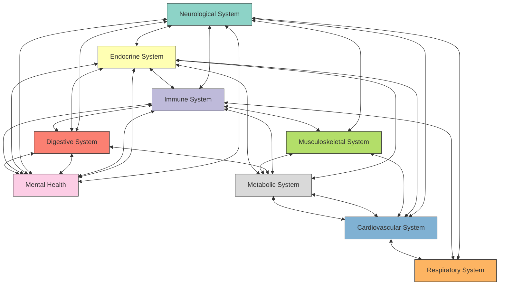
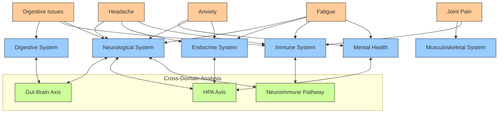

# Systems Medicine Enhancement for AI Doctor

This document describes the Systems Medicine enhancement added to the AI Doctor application. The enhancement enables the AI Doctor to employ a unified approach to healthcare that views the body as an interconnected system rather than isolated compartments.

## Overview

The Systems Medicine enhancement consists of three main components:

1. **SystemsMedicineModel**: A core model that represents the interconnections between different body systems and provides methods for cross-domain symptom analysis.
2. **SystemsMedicineIntegration**: An integration layer that connects the Systems Medicine model with the existing doctor agent and Bayesian engine.
3. **Integration with the main application**: Changes to the main application to use the Systems Medicine model.

## Systems Medicine Model

The `SystemsMedicineModel` class in `systems_medicine.py` implements the core Systems Medicine functionality. It maintains:

- A list of body systems (Neurological, Endocrine, Immune, Digestive, etc.)
- Bidirectional connections between body systems with strength values
- Mappings of symptoms to multiple body systems with association strengths
- Lifestyle factors and their impact on different body systems
- Common multi-system disease patterns

Key methods include:

- `get_related_systems(system)`: Returns systems related to the given system based on connection strength
- `get_systems_for_symptom(symptom)`: Returns body systems associated with a symptom
- `get_symptoms_for_system(system)`: Returns symptoms associated with a body system
- `analyze_symptom_pattern(symptoms)`: Analyzes a pattern of symptoms to identify affected body systems
- `identify_multi_system_patterns(symptoms)`: Identifies potential multi-system disease patterns
- `suggest_related_questions(symptoms)`: Suggests related questions to ask based on symptoms
- `explain_symptom_connections(symptoms)`: Explains the connections between symptoms across different body systems
- `suggest_lifestyle_interventions(affected_systems)`: Suggests lifestyle interventions based on affected systems
- `generate_holistic_assessment(symptoms)`: Generates a holistic health assessment

## Systems Medicine Integration

The `SystemsMedicineIntegration` class in `systems_medicine_integration.py` connects the Systems Medicine model with the doctor agent. It handles:

- Extracting symptoms and lifestyle factors from conversations
- Updating the Systems Medicine model based on the conversation
- Providing cross-specialty insights that span traditional medical boundaries
- Enhancing the doctor agent's responses with unified health perspectives

Key methods include:

- `extract_symptoms_from_text(text)`: Extracts symptoms from text using pattern matching
- `extract_lifestyle_factors_from_text(text)`: Extracts lifestyle factors from text
- `extract_from_intake(patient_info)`: Extracts symptoms and lifestyle factors from patient intake information
- `update_from_conversation(user_input, assistant_response)`: Updates the model based on the conversation
- `update_from_intake(patient_info)`: Updates the model based on patient intake information
- `get_holistic_assessment()`: Gets a holistic assessment based on the current state
- `get_cross_specialty_insights()`: Gets insights that span multiple medical specialties
- `enhance_response(user_input, assistant_response)`: Enhances the assistant's response with cross-specialty insights

## Integration with the Main Application

The main application (`app.py`) has been updated to use the Systems Medicine model:

1. The `SystemsMedicineModel` and `SystemsMedicineIntegration` classes are imported
2. A Systems Medicine integration instance is initialized in the session state
3. The `submit_form` function initializes the Systems Medicine model with patient intake information
4. The `call_openai_api` function enhances responses with Systems Medicine insights
5. The reset button handler resets the Systems Medicine model when the user resets the conversation
6. The doctor agent's instructions have been updated to emphasize the unified approach to healthcare

**Important Note**: The Systems Medicine insights are selectively added to responses when appropriate, such as when the user asks about connections between symptoms or when multiple body systems are involved. This ensures that the insights are relevant and helpful without overwhelming the user with unnecessary information.

## How It Works

### Unified Healthcare Approach

The Systems Medicine model takes a unified approach to healthcare:

1. **Interconnected Body Systems**: It views the body as one interconnected system rather than isolated compartments.
2. **Cross-Domain Symptom Analysis**: It identifies connections between symptoms across different body systems.
3. **Multi-Specialty Integration**: It weaves together insights from multiple medical specialties (neurology, endocrinology, gastroenterology, etc.).
4. **Lifestyle Factor Analysis**: It considers how diet, sleep, stress, and exercise affect multiple systems simultaneously.
5. **Holistic Interventions**: It suggests lifestyle modifications that address multiple systems at once.
6. **Pattern Recognition**: It identifies patterns that cross traditional medical boundaries.

### Unified Health Model Diagram

The following diagram illustrates the interconnections between different body systems in the unified health model:

### Cross-Domain Symptom Analysis Diagram

The following diagram illustrates how symptoms can span multiple body systems and how the Systems Medicine model analyzes these connections:

### Lifestyle Factors Impact Diagram

This diagram shows how lifestyle factors can affect multiple body systems simultaneously:

```mermaid
graph TD
    classDef lifestyle fill:#ff9999,stroke:#333,stroke-width:1px
    classDef system fill:#99ccff,stroke:#333,stroke-width:1px

    Diet[Diet]:::lifestyle
    Sleep[Sleep]:::lifestyle
    Exercise[Exercise]:::lifestyle
    Stress[Stress]:::lifestyle

    NS[Neurological System]:::system
    ES[Endocrine System]:::system
    IS[Immune System]:::system
    DS[Digestive System]:::system
    CS[Cardiovascular System]:::system
    MS[Musculoskeletal System]:::system
    MH[Mental Health]:::system
    MT[Metabolic System]:::system

    Diet --> DS
    Diet --> IS
    Diet --> MT
    Diet --> CS
    Diet --> NS

    Sleep --> NS
    Sleep --> ES
    Sleep --> IS
    Sleep --> MH

    Exercise --> MS
    Exercise --> CS
    Exercise --> MT
    Exercise --> MH
    Exercise --> IS

    Stress --> MH
    Stress --> NS
    Stress --> ES
    Stress --> IS
    Stress --> DS
    Stress --> CS
```

### Example Conversation Flow

1. The patient provides initial information through the intake form.
2. The Systems Medicine model initializes its state based on the intake information.
3. As the conversation progresses, the model extracts symptoms and lifestyle factors from the conversation.
4. The model analyzes which body systems are affected and identifies connections between symptoms.
5. When appropriate, the model enhances the doctor agent's responses with cross-specialty insights.
6. The model suggests related questions to ask based on the affected systems and their connections.

## Benefits of the Systems Medicine Approach

1. **Holistic Assessment**: Considers the whole person rather than isolated symptoms.
2. **Cross-Specialty Integration**: Weaves together insights from multiple medical specialties.
3. **Root Cause Focus**: Looks for underlying factors affecting multiple systems.
4. **Lifestyle Integration**: Emphasizes how diet, sleep, stress, and exercise affect the entire body.
5. **Patient-Centered**: Avoids the frustration of fragmented care across specialists.
6. **Interconnection Awareness**: Recognizes that symptoms in one system often affect or originate from other systems.
7. **Pattern Recognition**: Identifies patterns that cross traditional medical boundaries.

## Example Use Cases

### Case 1: Gut-Brain Connection

A patient reports digestive issues (bloating, constipation) along with anxiety and headaches. The Systems Medicine model:

1. Identifies that these symptoms span the Digestive, Neurological, and Mental Health systems
2. Recognizes the gut-brain axis connection between these symptoms
3. Suggests lifestyle interventions that address all systems (anti-inflammatory diet, stress management, sleep hygiene)
4. Provides a unified perspective that explains how these seemingly unrelated symptoms might be connected

### Case 2: Inflammatory Cascade

A patient reports joint pain, fatigue, and skin rashes. The Systems Medicine model:

1. Identifies that these symptoms span the Musculoskeletal, Immune, and Integumentary systems
2. Recognizes a potential inflammatory pattern affecting multiple systems
3. Suggests lifestyle interventions that address inflammation (anti-inflammatory diet, stress reduction, adequate sleep)
4. Provides a unified perspective that explains how inflammation can manifest across different body systems

### Case 3: Metabolic-Hormonal Interplay

A patient reports weight gain, fatigue, mood changes, and irregular periods. The Systems Medicine model:

1. Identifies that these symptoms span the Metabolic, Endocrine, and Mental Health systems
2. Recognizes the interconnections between hormonal balance, metabolism, and mood
3. Suggests lifestyle interventions that address all systems (balanced diet, regular exercise, stress management)
4. Provides a unified perspective that explains how hormonal imbalances can affect multiple aspects of health

## Future Improvements

1. **Expanded System Connections**: Add more detailed connections between body systems based on the latest research.
2. **Personalized System Weights**: Adjust the strength of system connections based on individual patient factors.
3. **Temporal Analysis**: Incorporate the temporal evolution of symptoms into the analysis.
4. **Integration with External Medical Databases**: Connect to external medical databases to update system connections based on the latest research.
5. **Machine Learning Enhancement**: Use machine learning to improve the accuracy of symptom-system associations and pattern recognition.
6. **Visualization Tools**: Develop visualization tools to help patients understand the interconnections between their symptoms.
7. **Specialized System Models**: Create more detailed models for specific body systems and their interactions.
8. **Outcome Tracking**: Track the effectiveness of holistic interventions across multiple body systems.
